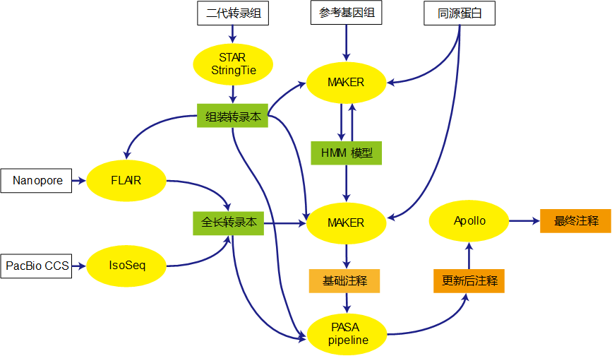

# 基因组注释流程

Whole-genome annotation pipeline, WGAP.

基因组结构注释流程如下

1. MAKER提供初步注释结果（简单重命名）
1. PASA对注释进行更新(多轮)
1. 基因重命名
1. 使用Apollo手工调整(可选)



## 数据准备

数据分为三种

- 基因组序列
- 蛋白序列
- 转录本序列

### 基因组序列

确保输入基因组序列的完整度

###  蛋白序列

从UniProt/Sprot下载人工检查过的高质量蛋白序列。

例如植物

```bash
wget ftp://ftp.uniprot.org/pub/databases/uniprot/current_release/knowledgebase/taxonomic_divisions/uniprot_sprot_plants.dat.gz
zcat uniprot_sprot_plants.dat.gz |\
    awk '{if (/^ /) {gsub(/ /, ""); print} else if (/^AC/) print ">" $2}' |\
    sed 's/;$//'> protein.fa
```

数据来源: ftp://ftp.uniprot.org/pub/databases/uniprot/current_release/knowledgebase/taxonomic_divisions/

### 转录本序列

转录组数据主要分为二代转录组（普通和链特异性）和三代转录组（PacBio和NanoPore）

## 使用方法

根据[依赖环境](#依赖环境)安装相关环境，然后下载本流程相关的代码

```bash
git clone https://github.com/WangLab-SIPPE/genome_annotation_pipeline.git
```

### 整合转录组

### 训练模型

#### 训练SNAP模型

#### 训练AUGUSTUS模型

### MAKER整合结果

### PASA 调整基因模型

### Apollo 手工调整


## 依赖环境

需要安装如下软件

基本环境

- Python
- Perl
- awk/sort 

转录组相关

- fastp
- samtools
- STAR
- StringTie
- PASA
- gffread

模型训练相关

- AUGUSTUS
- SNAP

- RepeatMasker
- MAKER
- ncbi-blast

可选

- Apollo
